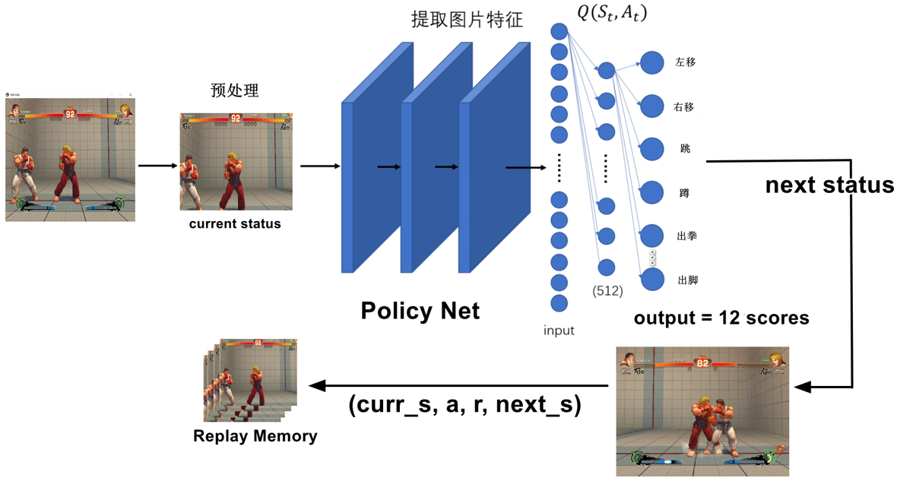
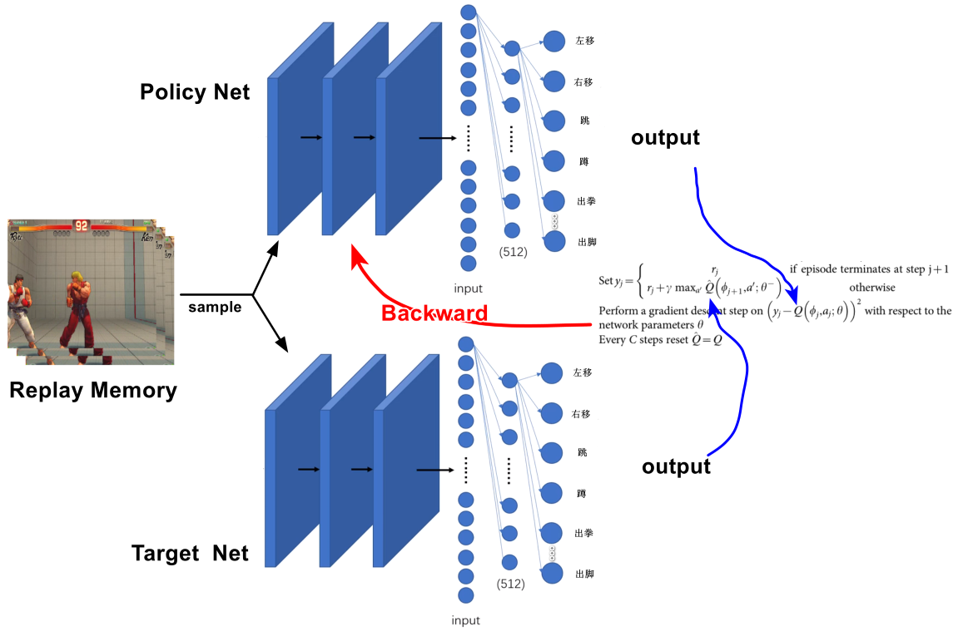
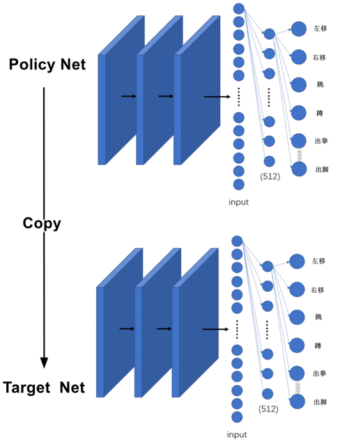
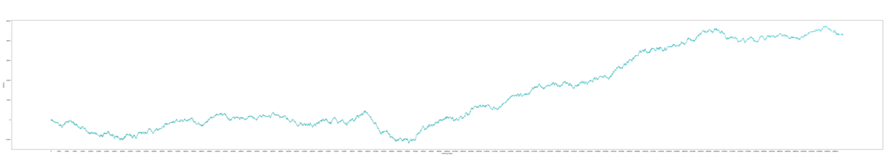

# 用强化学习玩街霸4

用强化学习DQN算法，训练AI模型来玩街霸4，提供的版本为PyTorch版本。由于训练环境是普通的家用台式机，显卡配置较低，因此采用了MobileNetV3-small作为该项目的backbone。

该模型通过截取游戏屏幕作为当前游戏的状态输入到网络中，生成奖励值最大的出招动作，然后保存该动作以及该动作导致的游戏状态到Replay Memory中，当Replay Memory满足一定的batchsize后，送入到Policy Net，并联合Target Net输出结果更新Policy Net参数。其中，一定迭代次数后，当前的Policy Net要作为历史版本，备份到Target Net，Target Net的作用是让训练过程保持稳定。

游戏中使用`隆`这个角色，模型在2w次的迭代训练下，能实现61%以上的胜率。目前只提供了训练代码以及预训练权重。

## 亮点
* 由于街霸4一个回个大概就半分钟，为了让网络能够自己开启新回合，实现全自动化训练，代码中已包含了对回合结束的检测，以及开启新回合的自动化操作

* 使用MobileNetV3-small作为backbone，可以实现在配置较低的电脑上也能进行训练

* 训练过程中为了实现实时的游戏画面截取，本项目采用pywin32进行游戏状态截取，能够有效降低状态截取延迟带来的训练误差

* 该模型使用`隆`这个角色，在20,000次迭代训练下实现了61%以上的胜率

* 该方法能推广到其它类似的游戏上，只需修改游戏状态的截取范围以及游戏角色血条截取范围即可

## 问题简述
* 由于网络在训练中，可能会遇到游戏卡顿的情况，因此，会对模型训练效果有一定的影响

* 由于游戏画面会随着角色的出招有较大的变化，有时候甚至会遮挡角色血条的判断，导致对当前动作给出错误的奖励或惩罚，会对模型的训练效果有一定的影响

* 当前回合结束以及新回合开始之间，可能会有游戏卡顿的情况，导致不得不人为重启游戏

## 网络流程图

## 奖励曲线

## Acknowledge

- [dqn] https://github.com/deepmind/dqn
- [pytorchvision] https://github.com/pytorch/vision